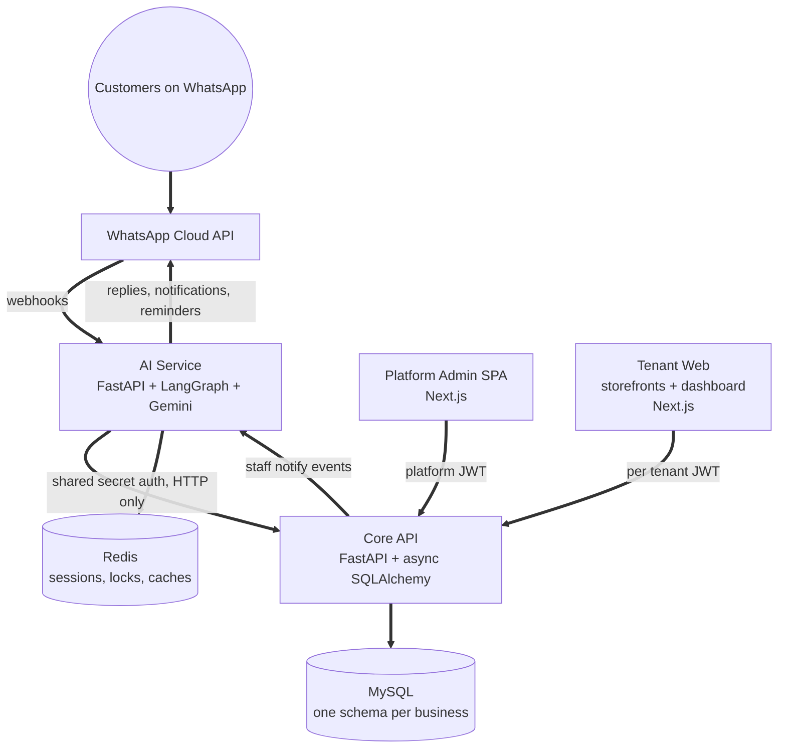
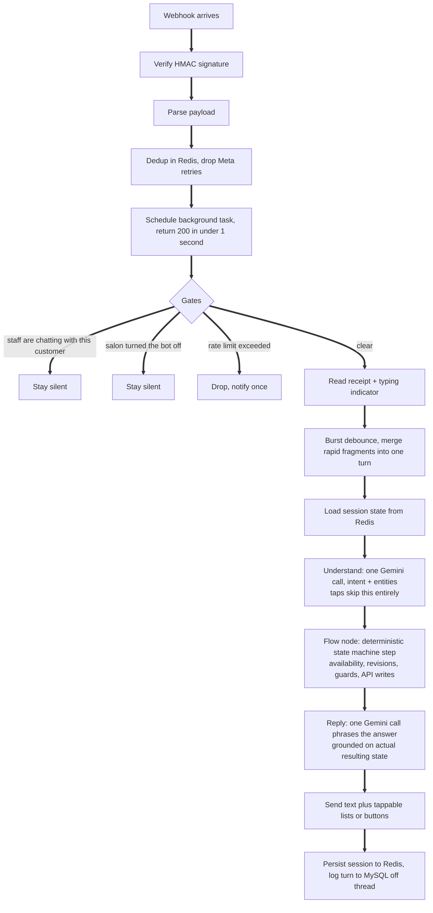

# Architecture

Four services, four repos, four independent deploy pipelines. This page is the map: what each service owns, the contracts between them, and what actually happens when a customer's message arrives.

## The system

* **Core API** is the hub. It owns both auth systems, all business data, the tenant provisioning, and a scheduler for reminders and auto completion. Everything else talks to it.
* **AI Service** is the WhatsApp brain: webhook handling, the conversation state machine, the model calls, and all WhatsApp sending (including staff notifications the API asks it to send). It holds no database credentials at all.
* **Tenant Web** serves each business a public storefront and a staff dashboard.
* **Platform Admin** is the internal app for onboarding and managing the businesses themselves.

## Boundaries that are rules, not habits

Two invariants shape everything:

* **The AI service never touches a database.** It is the most exposed service (public webhooks from the internet), so it gets the smallest blast radius. All business data comes over HTTP from the API; all its own state lives in Redis with TTLs. You can redeploy it mid conversation and the customer never notices.
* **The API never sends WhatsApp.** One owner per concern. When a booking is created or cancelled from *any* source (bot, dashboard, storefront), the API fires one fire and forget event at the AI service, which owns templates, credentials, and delivery.

## The four contracts

Each pair of services shares exactly one contract, and changing one side means updating the other:

1. **Admin to API.** Platform JWTs. Manages businesses, platform users, roles, permissions.
2. **Web to API.** Per tenant JWTs, keyed by business slug. One browser can hold live sessions for several businesses at once, which is why tokens are stored per slug and never collapsed into one key.
3. **AI to API.** No JWTs. A shared secret header on a dedicated internal route group. This is the bot's only data path.
4. **API to AI.** The reverse direction: booking events and reminder triggers, same shared secret, fire and forget. A delivery failure never breaks the booking that triggered it.

## Life of a message

The model is called at most twice per turn, and everything that touches the database sits in deterministic code between those two calls. If either call fails, keyword matching and fixed copy keep the conversation alive.

## State

There is no in memory session. Every piece of conversational state lives in Redis under a key namespaced by salon and customer, with a TTL chosen per purpose:

* Conversation history and booking progress: 24 hours.
* The customer's cached bookings: 5 minutes, busted on every write.
* Idempotency locks around booking writes: 5 minutes.
* Webhook dedup markers: 24 hours.
* The "humans are handling this customer" flag: the salon's configured handoff window.

A process restart or redeploy loses nothing. Two app instances behind a load balancer would share the same state for free.

## Multi tenancy

Each business gets its **own MySQL schema with its own encrypted credentials**, not a shared table with a tenant column. A query bug in one tenant's context physically cannot read another tenant's data. The price is a connection pool per business and a migration tool that applies schema changes across all of them; for a platform holding other businesses' customer data, that trade is easy.

On the WhatsApp side the same isolation holds: each salon connects its own number, webhooks are routed by Meta's stable phone number ID, and the bot sends from that salon's own credentials. A customer who messages two different salons from one phone gets two fully independent conversations.

## Deployment

Each repo deploys independently on push to main through GitHub Actions: the Python services to a VPS under PM2 behind nginx (the API can also target Render), the two Next.js apps to the VPS or Vercel. Four small pipelines instead of one big one means a bot fix never waits on a frontend build.
