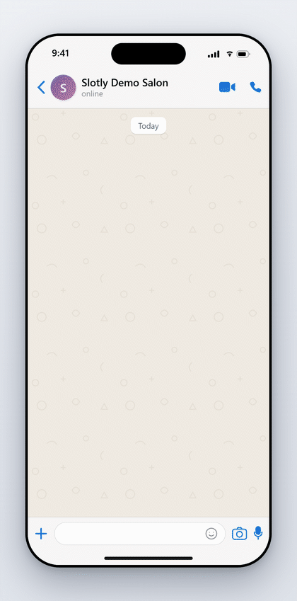
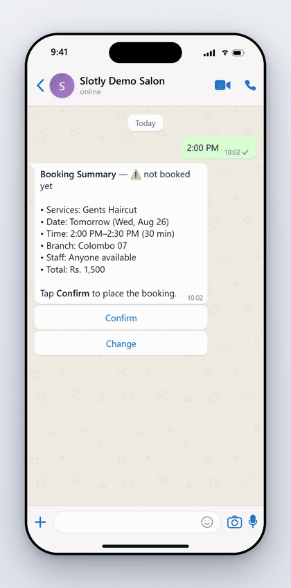
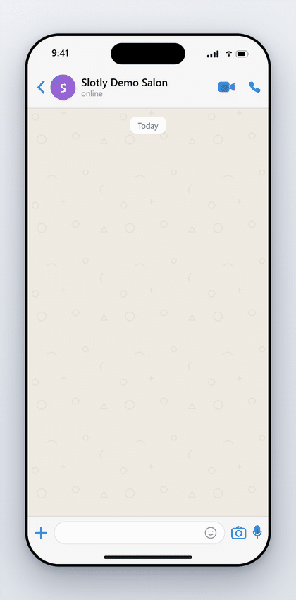
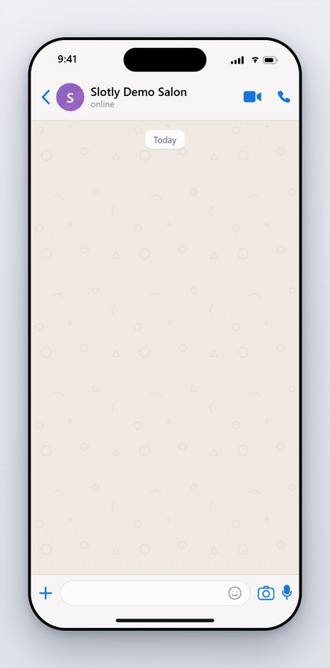
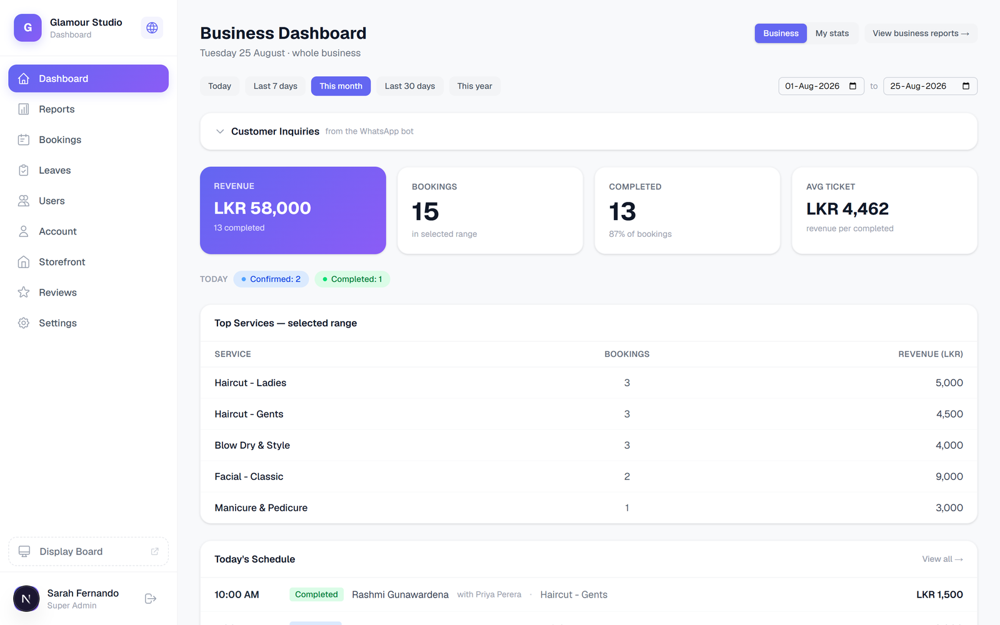
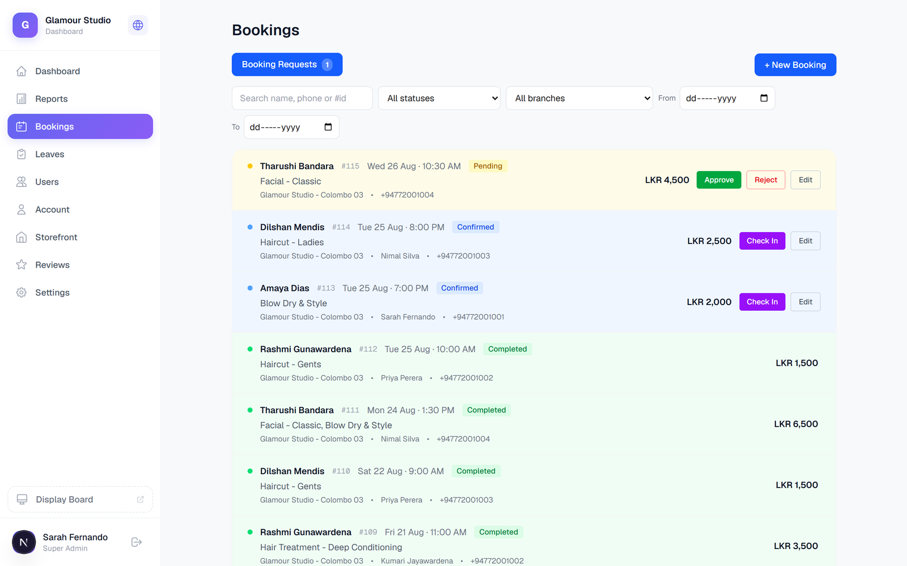
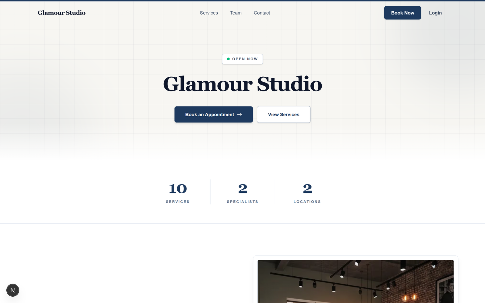
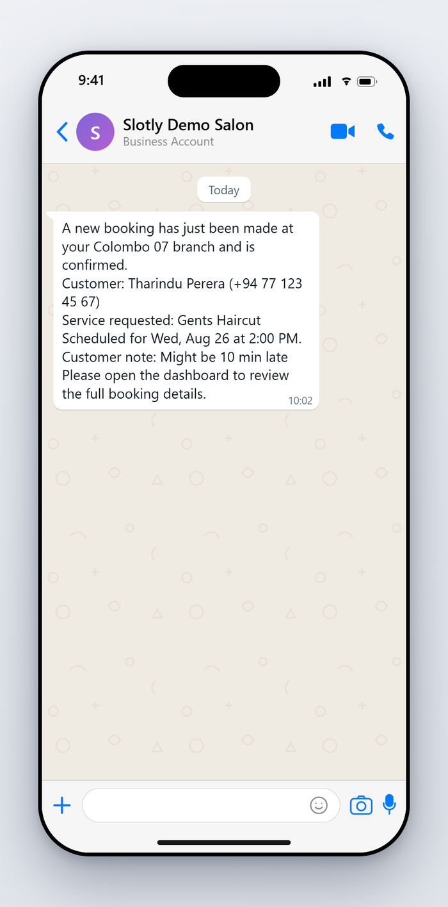

# Slotly — WhatsApp AI Booking Platform

A booking platform for salons and spas in Sri Lanka. Customers book, cancel, and reschedule appointments by chatting with an AI agent on WhatsApp — in Sinhala or English. Businesses get a dashboard, a public storefront, and automatic staff notifications.

It's running in production right now for Sri Lankan salons.

> **This repo is a case study, not the source code.** The platform is closed-source, so this page explains the architecture, the hard problems, and how I solved them — plus a few real code excerpts. Full commit history and a code walkthrough available on request.

<p align="center">
  
</p>
<p align="center"><em>A full booking, end to end — every step tappable, typing works everywhere.</em></p>

---

## Try it yourself 💬

Message the demo salon on WhatsApp: **+94 72 328 9213**

Try something like *"I want to book a haircut tomorrow at 2pm"* — or type in Sinhala. The bot replies in Sinhala by default; say *"reply in English"* to switch. Every step comes with tappable buttons and lists, but you can also just type.

Storefront and dashboard demo: available on request.

---

## At a glance

| | |
|---|---|
| **Status** | In production with live salons (real customers, daily bookings) |
| **Services** | 4 separately deployed services: core API, AI chatbot, tenant web app, admin app |
| **AI** | LangGraph state machine + Google Gemini, 8 conversation flows, Sinhala + English |
| **Multi-tenancy** | One MySQL schema per business, one WhatsApp number per salon |
| **Tests** | 1,701+ automated tests, plus a real-LLM eval suite that runs nightly in CI |
| **Speed** | Webhooks acknowledged in under 1 second; conversations survive restarts |

## Why this exists

Small salons here take bookings over the phone or by answering WhatsApp messages by hand. Appointments live in a notebook or in the manager's head. Double-bookings happen, nobody reminds customers, and messages sent after closing time just sit there.

The usual booking SaaS tools don't fit this market. They're English-only, priced in dollars, and expect customers to install an app. Sri Lankan customers are already on WhatsApp, and many prefer Sinhala. So the booking agent had to live inside WhatsApp and speak the customer's language.

## What I built

- **A WhatsApp AI agent** that handles the whole booking lifecycle in normal conversation — multiple services in one booking, staff preferences, availability, reschedules, cancellations. Every step is also tappable (WhatsApp lists and buttons).
- **A public storefront** for each business, with online booking and 5 visual templates.
- **A staff dashboard** for bookings, services, branches, staff, leave, and settings.
- **An admin app** for onboarding and managing the businesses on the platform.
- **Staff notifications and customer reminders** over WhatsApp, using pre-approved Meta templates.

## See it in action

| Mid-flow revision | Honest about availability | Sinhala |
|---|---|---|
|  |  |  |
| *"actually make it 3:30pm" — latest value wins, availability re-checked, summary re-shown* | *A slot that can't fit is explained honestly — never "someone just took it"* | *Casual spoken Sinhala, structured data stays English* |

*(Scripted demos of the production bot's real reply formats — message the demo number above to try it live.)*

## Architecture

```
                    ┌──────────────────────────────────┐
                    │            Core API                │
                    │   FastAPI · async SQLAlchemy       │
                    │   MySQL (schema per tenant)        │
                    └───┬──────────┬──────────┬──────────┘
        platform JWT    │          │ tenant   │ shared-secret
                        │          │ JWT      │ service auth
              ┌─────────▼───┐      │     ┌────▼──────────────┐
              │  Platform   │      │     │   AI Service      │
              │  Admin SPA  │      │     │ FastAPI+LangGraph │
              │  (Next.js)  │      │     │ + Gemini + Redis  │
              └─────────────┘      │     └────┬──────────────┘
                            ┌──────▼──────┐   │  WhatsApp Cloud API
                            │ Tenant Web  │   │  (Meta) ⇄ customers
                            │  (Next.js)  │   │
                            └─────────────┘   └─ staff notifications
```

Four services, four repos, four independent deploy pipelines (GitHub Actions → VPS/PM2, Render, Vercel). The core API is the hub. The AI service never touches a database — everything goes through the API over HTTP.

## Design decisions I'd defend in an interview

**One MySQL schema per business.** Not row-level `tenant_id` filtering — each business gets its own schema with its own encrypted credentials. A query bug in one tenant's context physically can't read another tenant's data. The cost is managing N schemas and a migration tool that applies changes across all of them. Worth it when you're holding other businesses' customer data.

**The AI service holds no database credentials.** It's the most exposed service (public webhooks from Meta), so it gets the smallest blast radius. All its state lives in Redis with TTLs; all business data comes from the API. You can restart or redeploy it without losing a conversation mid-booking.

**One LLM call to understand, deterministic code to act.** Each message gets one Gemini call that extracts intent and entities. After that it's a state machine: 8 flows with explicit steps, slot filling, and revision handling ("actually make it 3pm" mid-flow just works). If Gemini is down, keyword matching and deterministic parsers keep basic booking alive. The LLM understands and phrases replies — it never decides what gets written to the database.

**Reschedule is atomic.** The naive version (cancel old, book new) can fail halfway and leave the customer with nothing. Instead the API creates the replacement first, then retires the original, in one transaction. Any failure leaves the original booking untouched.

**Double-taps can't double-book.** Two taps on "Confirm" are two real webhook events, and both pass message-level dedup. A Redis lock keyed on the booking identity (customer + branch + slot + services + staff) makes the second one a no-op. See [`excerpts/idempotency_guard.py`](excerpts/idempotency_guard.py).

**Each salon keeps its own WhatsApp number.** The bot routes each webhook by Meta's stable `phone_number_id` and sends from that salon's own credentials. And when a staff member replies to a customer from the salon's own WhatsApp app, the bot detects it and goes quiet for that customer for a while. Humans always win.

**The bot follows the business's rules.** Salons that require approval get "booking requested" instead of instant confirmation. Booking-notice limits are enforced. Closed days never show up in date pickers. If a salon turns the bot off, it goes completely silent — but an API outage never mutes a live salon (everything fails open).

## Bugs that only production teaches you

All of these came from real customer conversations, not test plans:

- **"Only the haircut" didn't work.** A customer removing a service from their booking got a friendly "sure, removed!" — while the cart silently kept everything. The reply LLM was confirming things the code never did. Fix: cart changes are owned by deterministic code, and the reply is generated from the *actual* resulting cart, so the bot can't claim something that didn't happen.
- **A reschedule collided with itself.** Changing only the staff member made the appointment fail its own availability check — "that time is taken" — taken by the customer's own booking. Fix: reschedule availability checks now exclude the appointment being moved.
- **"6 of us at 9am" booked one person.** There's no group capacity model, so the headcount was silently dumped into a notes field. Now the NLU extracts party size (with a deterministic backstop scanning for headcounts it missed), and the bot says plainly that it can't book groups — and alerts a manager instead.
- **A staff name that matched nobody became "sure, Nimal it is!"** A silent no-op that the reply LLM dressed up as success. Now an unmatched name gets an honest "couldn't match that name" plus a tappable staff picker.
- **Booking notes are an injection surface.** Customer free text ends up in dashboards, WhatsApp templates, and LLM prompts. It gets sanitized at capture (control characters stripped, length capped, single line) and is always marked as data, never instructions, in prompts. See [`excerpts/note_sanitizer.py`](excerpts/note_sanitizer.py).

Every fix shipped with regression tests. The suite is at 1,400+ tests now.

## Security

- Every incoming webhook is verified with HMAC-SHA256 before any field is trusted.
- Two fully separate auth systems: platform-admin JWTs and per-tenant JWTs. A tenant token can't touch platform routes, and one browser can hold sessions for several businesses at once.
- Tenant database credentials are encrypted at rest. The AI service has none at all.
- Customer-typed text is sanitized at capture and kept structurally separate from instructions in every prompt.
- Per-customer rate limits (sliding window + daily cap) that fail open — for a booking bot, availability beats strictness.

## Sinhala that actually sounds right

This was more work than it sounds:

- The bot speaks **casual spoken Sinhala** — the register people actually text in — not the formal written form. Word choice matters: *staff*, not සේවකයා (which reads as "servant"). The voice was reviewed with a native-speaking product owner.
- The NLU handles **romanized Sinhala** ("kmk na" = "doesn't matter") and mixed Sinhala/English in one message, because that's how people really type.
- Dates, times, and prices stay in English inside Sinhala sentences — matching how Sri Lankans text.
- Each customer has their own language preference. They switch by just asking, and it sticks.

## Testing an LLM system

Two layers, because each catches what the other can't:

1. **1,400+ deterministic tests** with the LLM faked — units, full conversation-flow simulations, and five hardening tiers (silent failures, messy multi-intent conversations, weird inputs, odd configs, failure injection).
2. **A real-LLM eval suite** that runs scored conversation journeys against live Gemini — NLU accuracy, Sinhala reply quality, 33 adversarial attack prompts, edge-case recovery. Scores against thresholds, never exact text matching. Runs nightly in CI with a regression gate.

The eval suite caught real regressions before customers did.

## Stack

| Layer | Tech |
|---|---|
| Core API | Python, FastAPI, SQLAlchemy 2.0 (async), MySQL, Redis, Pydantic v2 |
| AI service | Python, FastAPI, LangGraph, LangChain, Google Gemini, Redis, httpx |
| Web + admin | Next.js (App Router), React, TypeScript, SWR, Framer Motion |
| Messaging | WhatsApp Cloud API, approved message templates, interactive lists/buttons |
| Infra | GitHub Actions CI/CD, VPS + PM2 + nginx, Render, Vercel, Cloudinary |

## My role

Built with one partner over about 4 months. The split, backed by commit history (available on request):

- **The AI service is mine end-to-end**: the conversation architecture, NLU design, all 8 flows, the WhatsApp integration (multi-tenant sending, staff handoff, templates), the test and eval infrastructure, and all the production hardening above.
- **I built the API's AI-facing layer** — the 31 internal endpoints the bot uses, staff notifications, reminder scheduling — and contributed across the core API.
- My partner led the tenant web app, the admin app, and the core API's foundation.

## Code excerpts

Three small, self-contained files, copied from the production codebase:

- [`excerpts/idempotency_guard.py`](excerpts/idempotency_guard.py) — the double-tap booking lock
- [`excerpts/note_sanitizer.py`](excerpts/note_sanitizer.py) — sanitizing customer free text before it travels
- [`excerpts/tenant_routing.py`](excerpts/tenant_routing.py) — routing webhooks to the right salon, with fail-open config caching

## Deep dives

Four longer reads for anyone who wants the full engineering story:

* [`ARCHITECTURE.md`](ARCHITECTURE.md) — the four services, the contracts between them, and the life of a message from webhook to reply
* [`EVALS.md`](EVALS.md) — how you test an LLM system: 1,400+ deterministic tests plus a nightly real-model eval suite with a regression gate
* [`RELIABILITY.md`](RELIABILITY.md) — production war stories: the day the model leaked its own prompt, timeouts that aren't failures, and choosing fail-open vs fail-safe
* [`COST_AND_LATENCY.md`](COST_AND_LATENCY.md) — sub-second webhook acks, a two-call-per-turn token ceiling, and measuring cost instead of guessing

## Screenshots

The web side, running with demo data:







And what a branch manager's phone shows the moment a booking lands:

<p align="center">
  
</p>

---

*Udana Methmal · [github.com/methmal59](https://github.com/methmal59) · udana.methmal59@gmail.com*
